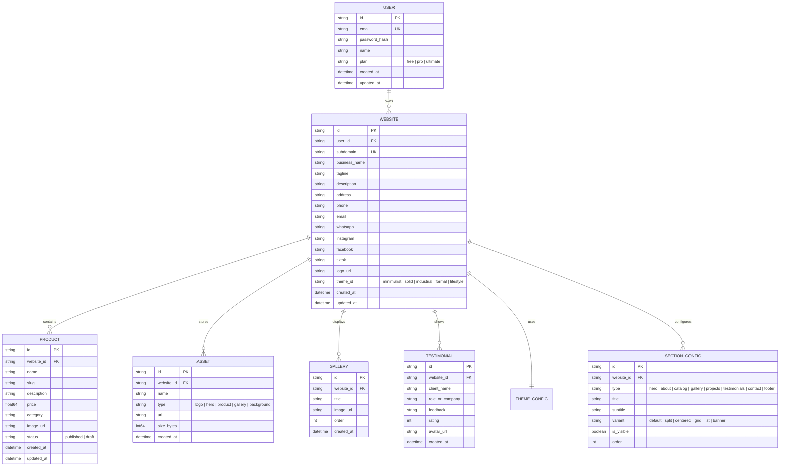

# BizCatalog Builder - System Analysis & Architecture (Phase 1)

## 1. Entity Relationship & Data Model (ERD)



---

## 2. API Specification (REST API)

### 2.1 Authentication & User
- `POST /api/auth/register`
  - Body: `{ "name": "...", "email": "...", "password": "...", "subdomain": "...", "business_name": "..." }`
  - Response: `{ "token": "...", "user": {...}, "website": {...} }`
- `POST /api/auth/login`
  - Body: `{ "email": "...", "password": "..." }`
  - Response: `{ "token": "...", "user": {...}, "website": {...} }`
- `GET /api/user/profile` (Auth required)
- `PUT /api/user/profile` (Auth required)

### 2.2 Website & Company Profile
- `GET /api/website/my` (Auth required - get user's primary website)
- `PUT /api/website/my` (Auth required - update company profile & settings)

### 2.3 Product Catalog
- `GET /api/products` (Auth required)
- `POST /api/products` (Auth required + Subscription limit check)
- `GET /api/products/:id` (Auth required)
- `PUT /api/products/:id` (Auth required)
- `DELETE /api/products/:id` (Auth required)

### 2.4 Asset Library
- `GET /api/assets` (Auth required)
- `POST /api/assets/upload` (Auth required - multipart/form-data)
- `DELETE /api/assets/:id` (Auth required)

### 2.5 Section Builder & Theme
- `GET /api/website/sections` (Auth required)
- `PUT /api/website/sections` (Auth required - bulk update order, variant, visibility)
- `PUT /api/website/theme` (Auth required - set active theme with plan validation)

### 2.6 Public Dynamic Website
- `GET /api/public/website/:subdomain` (Public access - returns website info, products, active sections, theme config, testimonials, gallery)

---

## 3. Plan Quotas & Limits (Subscription Matrix)

| Feature | Free | Pro | Ultimate |
| :--- | :--- | :--- | :--- |
| **Maksimal Website** | 1 Website | 1 Website | Multi Website |
| **Maksimal Produk** | 5 Produk | 25 Produk | 100 Produk |
| **Pilihan Tema** | 1 Tema (Minimalist) | Semua Tema (5 Tema) | Semua Tema (5 Tema) |
| **Asset Library** | 10 MB Storage | 100 MB Storage | 1 GB Storage |
| **Multi-User Admin** | Tidak | Tidak | Ya |

---

## 4. Struktur Direktori Proyek

```text
bizcatalog/
├── backend/
│   ├── cmd/
│   │   └── server/
│   │       └── main.go
│   ├── internal/
│   │   ├── handlers/       # HTTP Request Handlers
│   │   ├── middleware/     # Auth, Logger, CORS, Subscription
│   │   ├── models/         # Go Structs & Data Models
│   │   └── repository/     # JSONStore Database Layer
│   ├── data/               # Persistent JSON DB (db.json)
│   ├── uploads/            # Static uploaded media assets
│   ├── go.mod
│   └── go.sum
├── frontend/
│   ├── src/
│   │   ├── components/     # UI Components, Shared, Layout
│   │   ├── pages/
│   │   │   ├── marketing/  # Landing Page, Pricing, Auth
│   │   │   ├── dashboard/  # Company, Products, Assets, Builder, Theme
│   │   │   └── public/     # Dynamic Public Website Renderer
│   │   ├── themes/         # Minimalist, Solid, Industrial, Formal, Lifestyle definitions
│   │   ├── store/          # Zustand auth & website state stores
│   │   ├── types/          # TypeScript interfaces matching backend models
│   │   ├── api/            # Fetch client & endpoints
│   │   ├── App.tsx
│   │   └── main.tsx
│   ├── package.json
│   └── vite.config.ts
└── docs/
    ├── bizcore.md
    └── architecture.md
```
