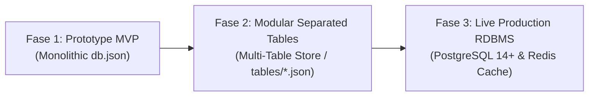
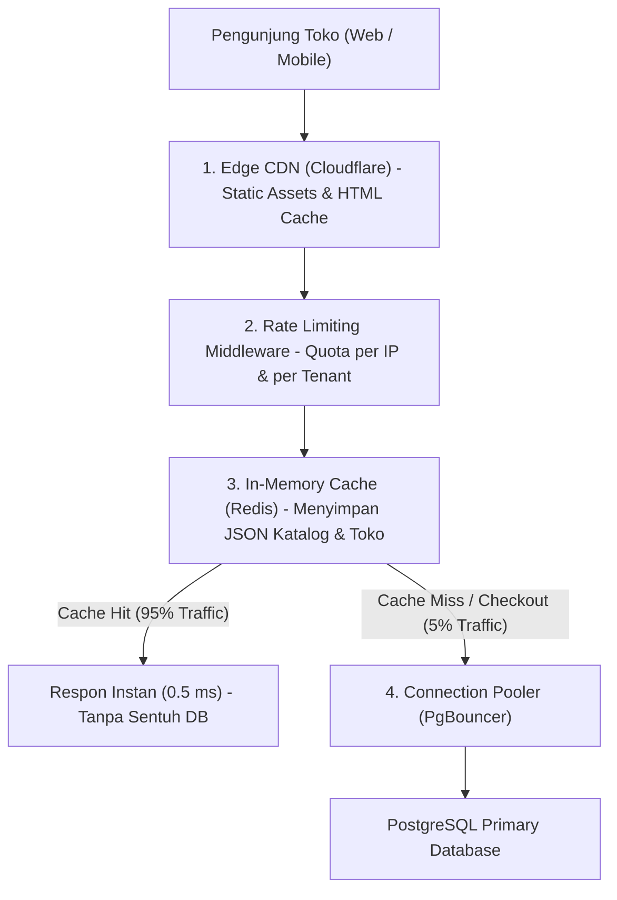

# Panduan Arsitektur Database & Roadmap Menuju Live Production

Dokumen ini mendokumentasikan hasil analisis arsitektur, strategi **Multi-Tenancy**, mitigasi masalah **Noisy Neighbor**, dan panduan langkah demi langkah (*actionable roadmap*) untuk migrasi database BizCatalog ke lingkungan **Live Production**.

---

## 1. Filosofi & Evolusi Database BizCatalog

Perjalanan arsitektur database platform BizCatalog terbagi ke dalam 3 fase evolusi:



1. **Fase 1 (Awal - Single Monolith)**:
   - Seluruh data 9 entitas disimpan dalam 1 file `db.json`.
   - *Kelemahan*: Lock contention global, penulisan lambat saat data tumbuh, tidak ada isolasi data.
2. **Fase 2 (Saat Ini - Modular Separated Tables)**:
   - Data dipisah menjadi 9 file independen di `backend/data/tables/` (`users.json`, `websites.json`, `products.json`, `categories.json`, `orders.json`, `sections.json`, `testimonials.json`, `galleries.json`, `assets.json`).
   - Masing-masing tabel memiliki `sync.RWMutex` sendiri, atomic write (`.tmp` -> `rename`), dan I/O terisolasi.
3. **Fase 3 (Target Live Production)**:
   - Menggunakan database relasional enterprise **PostgreSQL 14+** (atau MySQL 8.0+) yang mengimplementasikan interface [`repository.Repository`](file:///Users/macbookpro/bizcatalog/backend/internal/repository/repository.go).
   - Dilengkapi lapisan **Redis In-Memory Cache**, **Row-Level Security (RLS)**, dan **Connection Pooler (PgBouncer)**.

---

## 2. Strategi Multi-Tenancy: Shared Database vs Database-per-Tenant

### 2.1 Perbandingan Dua Pendekatan

| Parameter Evaluasi | Pendekatan A: Shared Database (Rekomendasi Utama) | Pendekatan B: Database-per-Tenant (DB Masing-masing Klien) |
| :--- | :--- | :--- |
| **Konsep** | 1 Database engine & 1 set tabel bersama, dipisahkan oleh kolom `website_id`. | Setiap user/toko yang mendaftar dibuatkan 1 database terpisah. |
| **Biaya Server / Resource** | **Sangat Hemat & Efisien**. Hanya butuh 1 connection pool dan 1 cluster DB. | **Sangat Boros**. Mengelola ribuan koneksi DB memakan RAM & socket server secara masif. |
| **Kemudahan Update Fitur** | **Instan & Praktis**. 1 kali `ALTER TABLE` / migrasi SQL, seluruh ribuan toko langsung menikmati fitur baru. | **Mimpi Buruk Pemeliharaan**. Menjalankan script migrasi ribuan kali satu per satu ke setiap DB. Risiko inkonsistensi data tinggi. |
| **Analitik Super Admin** | **Sangat Cepat**. Query agregasi global (total GMV platform, order terbanyak, toko terpopuler) cukup dengan 1 query SQL. | **Sangat Rumit**. Harus looping koneksi ke ribuan database lalu menggabungkan hasilnya manual di memory. |
| **Isolasi Data** | Logical Isolation via `website_id` + Row-Level Security (RLS). | Physical Isolation (terpisah secara file/koneksi fisik). |
| **Standar Industri** | Dipakai oleh **Shopify, Stripe, Slack, Tokopedia, Notion**. | Dipakai perbankan, instansi kesehatan (HIPAA), atau on-premise software. |

### 2.2 Keputusan Arsitektur BizCatalog: **Shared Database dengan Logical Isolation**
Platform BizCatalog secara resmi mengadopsi **Shared Database Multi-Tenant** karena:
- Karakteristik bisnis SaaS UMKM menuntut efisiensi biaya infrastruktur yang tinggi dan kecepatan iterasi fitur.
- Skema database di [`backend/migrations/001_initial_schema.sql`](file:///Users/macbookpro/bizcatalog/backend/migrations/001_initial_schema.sql) telah dipersiapkan dengan Foreign Key `website_id` dan indeks performa tinggi pada setiap tabel relasional.
- **Opsi Hybrid Masa Depan (Dedicated DB)**: Jika di kemudian hari ada brand korporat (*Enterprise Tier*) yang membayar paket jutaan rupiah per bulan dan memiliki regulasi data khusus, sistem dapat mengarahkan koneksi tenant tersebut ke instance database khusus.

---

## 3. Strategi Mengatasi Masalah "Noisy Neighbor"

> **Noisy Neighbor** terjadi jika ada salah satu toko yang sedang viral (misal: *Flash Sale* / viral di TikTok) dan diserbu puluhan ribu pengunjung sekaligus, sehingga berpotensi menyedot seluruh resource CPU, RAM, dan koneksi database hingga memperlambat toko-toko lain.

Berikut **4 Lapisan Pertahanan (Defense-in-Depth)** yang akan diaktifkan pada fase production:



### 3.1 Lapisan 1: Redis In-Memory Caching (Peredam Utama)
- **Fakta**: 95% traffic e-commerce publik adalah operasi **Read** (melihat katalog, membaca ulasan, scroll banner promo). Hanya 5% yang berupa operasi **Write** (membuat pesanan / checkout).
- **Implementasi**:
  - Endpoint `GET /api/public/website/:subdomain` disimpan di Redis dengan key `cache:site:{subdomain}` dan Time-To-Live (TTL) 5-15 menit.
  - Ketika sebuah toko dibuka oleh 50.000 pengunjung dalam 1 menit, **hanya request pertama yang menyentuh database**. 49.999 request sisanya dilayani langsung dari RAM Redis dalam waktu sub-milidetik (< 1 ms).
  - **Cache Invalidation**: Jika pemilik toko mengupdate produk atau tema di admin panel, backend otomatis menghapus key cache toko terkait (`redis.Del("cache:site:" + subdomain)`).

### 3.2 Lapisan 2: Tenant Rate Limiting & Quota Throttling
- Memasang middleware Rate Limiting berbasis token bucket (misal: `golang.org/x/time/rate` atau Redis Rate Limiter):
  - **Paket Free**: Max 120 request/menit.
  - **Paket Pro**: Max 1.200 request/menit.
  - **Paket Ultimate**: Max 6.000 request/menit.
- Jika sebuah toko melebihi batas wajar atau diserang DDoS/bot, API Gateway langsung menolak kelebihan traffic dengan status `HTTP 429 Too Many Requests` di pintu depan sebelum sempat membebani database.

### 3.3 Lapisan 3: Connection Pooling dengan PgBouncer
- Database PostgreSQL secara *default* memiliki batas koneksi bersamaan (misal 100-200 koneksi). Jika habis, aplikasi akan mengalami error `too many connections` (*connection starvation*).
- Dengan **PgBouncer** (mode *Transaction Pooling*), ribuan goroutine Go dapat berbagi pool kecil (misal 20-30 koneksi fisik) secara bergantian dan sangat cepat tanpa overhead alokasi memori process PostgreSQL.

### 3.4 Lapisan 4: Read-Write Separation (CQRS Replica)
- Untuk fase skala puluhan ribu toko aktif:
  - **Database Primary**: Khusus transaksi modifikasi data (`INSERT`, `UPDATE`, `DELETE` pada pesanan dan profil).
  - **Database Read Replica**: Khusus melayani query pencarian dan penampilan katalog produk.

---

## 4. Keamanan Data: PostgreSQL Row-Level Security (RLS)

Untuk menjamin bahwa toko A tidak akan pernah bisa membaca data toko B secara tidak sengaja (*human error* pada kodingan query), fase production akan mengaktifkan **Row-Level Security (RLS)** di level mesin PostgreSQL.

### Contoh Implementasi RLS:

```sql
-- 1. Aktifkan RLS pada tabel sensitif
ALTER TABLE orders ENABLE ROW LEVEL SECURITY;
ALTER TABLE products ENABLE ROW LEVEL SECURITY;

-- 2. Buat Policy Isolasi Berdasarkan Session Variable
CREATE POLICY tenant_isolation_policy ON orders
    USING (website_id = current_setting('app.current_website_id', true));

CREATE POLICY tenant_isolation_policy ON products
    USING (website_id = current_setting('app.current_website_id', true));
```

Setiap kali backend menerima request dari user login, backend cukup menyetel variabel session database sebelum menjalankan query:
```go
// Di awal transaksi:
db.Exec("SET LOCAL app.current_website_id = ?", websiteID)
// Mesin PostgreSQL otomatis menolak semua baris data di luar websiteID tersebut!
```

---

## 5. Checklist Tahapan Migrasi Menuju Live Production

Gunakan daftar periksa berikut saat platform siap dideploy ke server production:

###  Fase Persiapan Infrastruktur
- [ ] Sewa instance Managed PostgreSQL (misal: AWS RDS, Supabase, Neon, DigitalOcean Managed DB, atau VPS Docker PostgreSQL).
- [ ] Sewa instance Managed Redis (misal: Redis Cloud, Upstash, atau VPS Docker Redis).
- [ ] Hubungkan domain utama BizCatalog ke **Cloudflare CDN** untuk caching aset statis dan proteksi DDoS.

### 🛠️ Fase Eksekusi Database
- [ ] Jalankan skema awal dari file [`backend/migrations/001_initial_schema.sql`](file:///Users/macbookpro/bizcatalog/backend/migrations/001_initial_schema.sql).
- [ ] Buat package repository baru `backend/internal/repository/postgres_store.go` yang mengimplementasikan interface `repository.Repository` menggunakan driver `pgx` atau `GORM`.
- [ ] Buat script migrasi data satu kali (*data importer script*) untuk memindahkan data dari `backend/data/tables/*.json` ke tabel PostgreSQL.

### 🛡️ Fase Optimasi & Keandalan
- [ ] Pasang middleware caching Redis pada route `GetPublicWebsite`.
- [ ] Pasang middleware Rate Limiting per tenant.
- [ ] Pasang PgBouncer di antara Go backend dan PostgreSQL.
- [ ] Konfigurasikan automated snapshot backup harian (WAL-G atau pg_dump terjadwal ke AWS S3 / Cloudflare R2).

---

> Dokumen ini adalah rujukan standar arsitektur database resmi BizCatalog. Setiap penambahan fitur baru di masa mendatang harus tetap mematuhi prinsip isolasi domain dan efisiensi multi-tenancy yang tercantum di sini.
