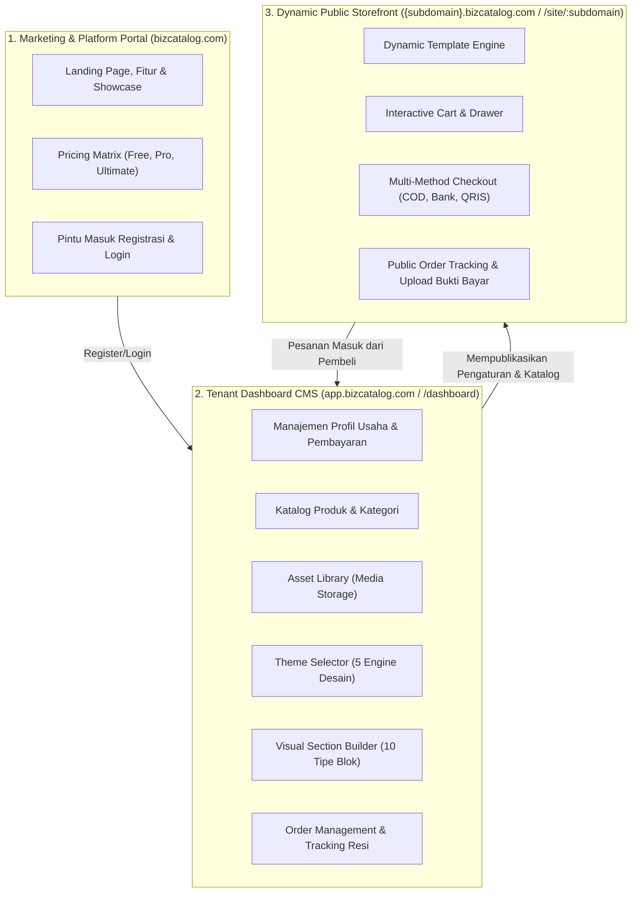
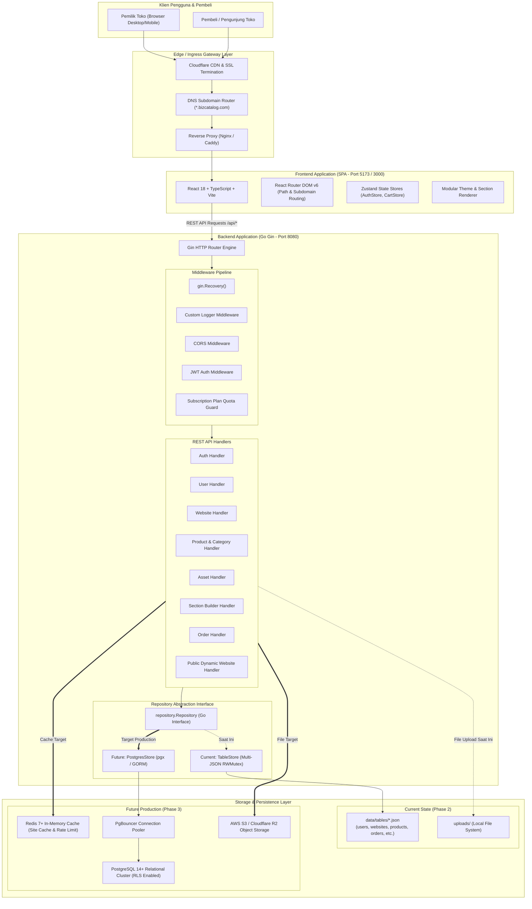
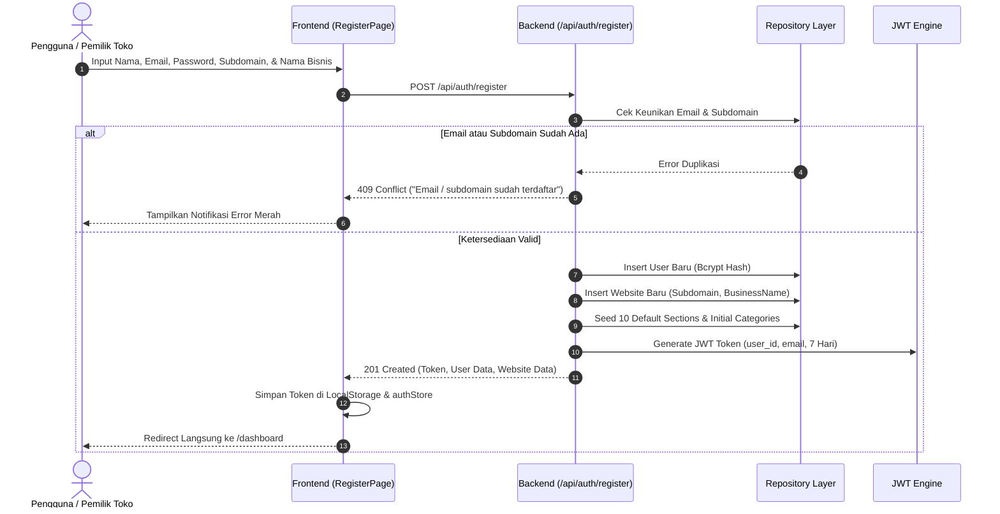
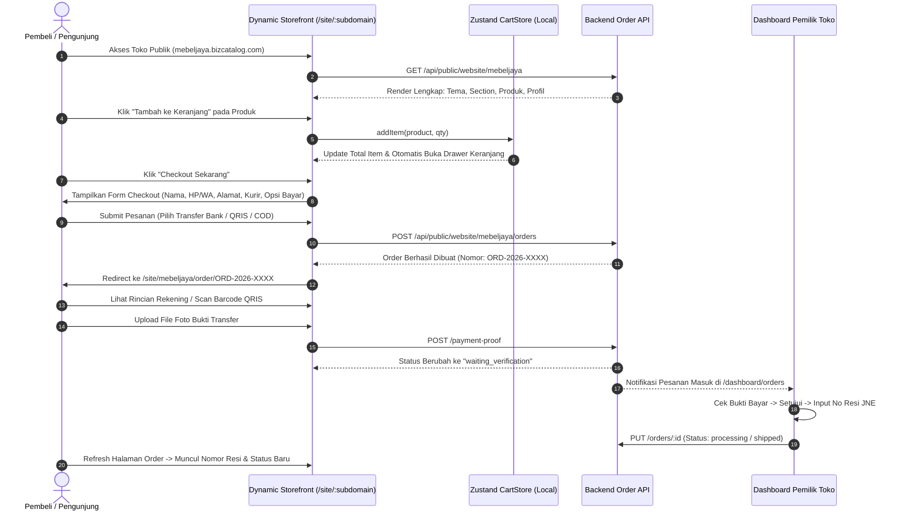
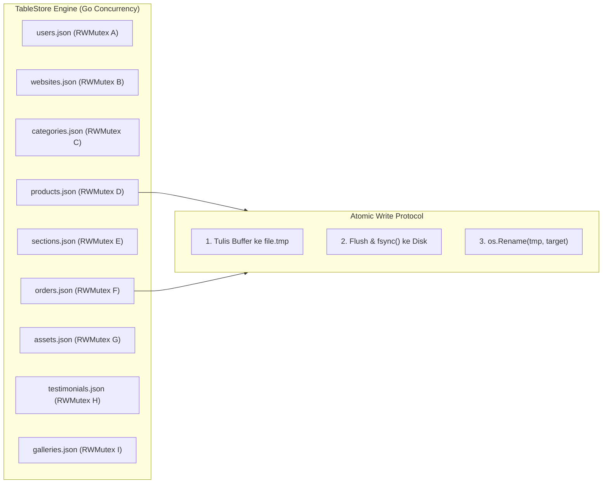
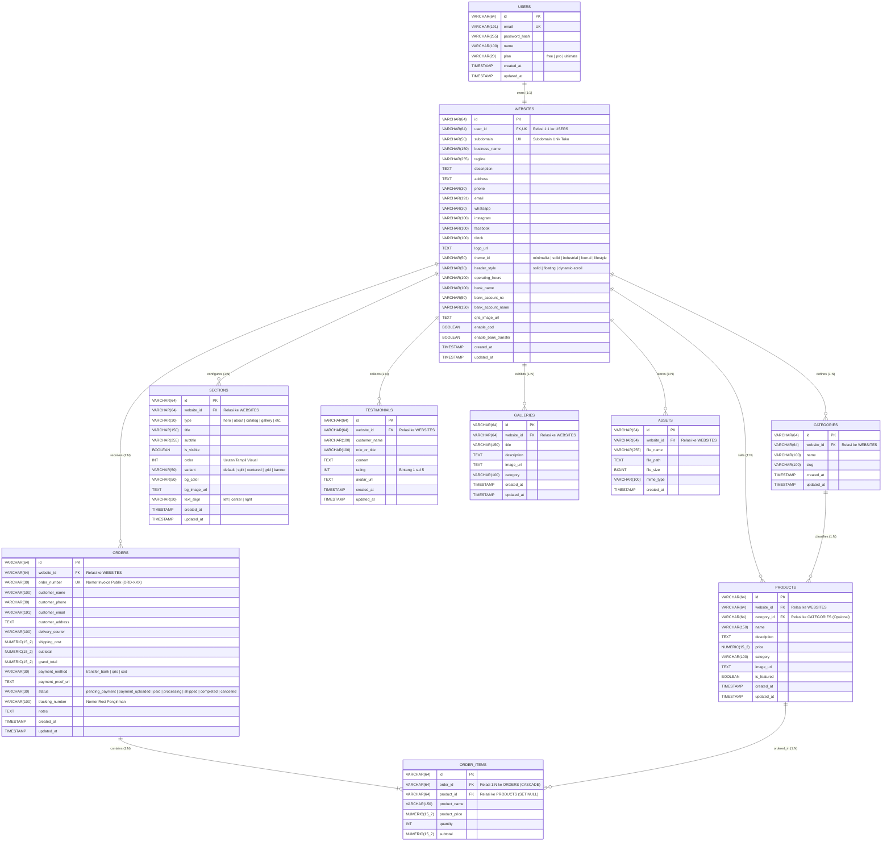
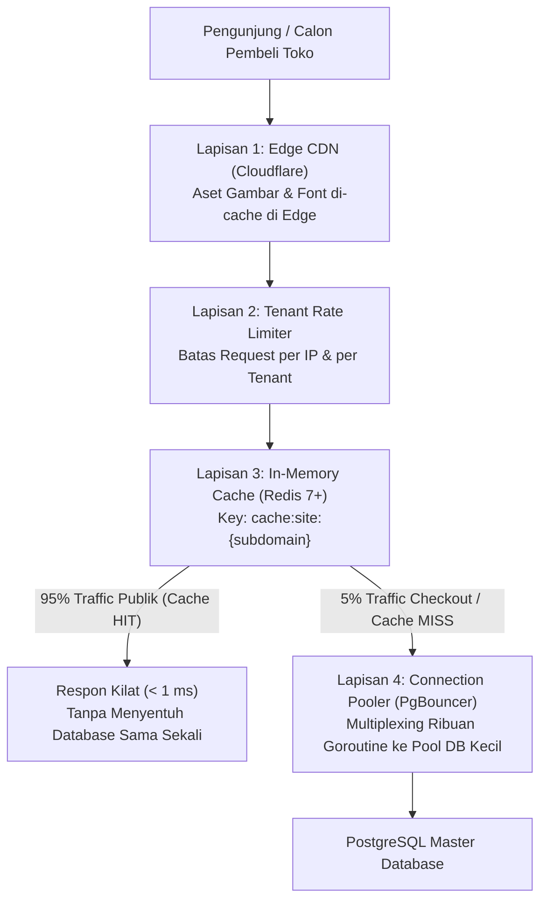
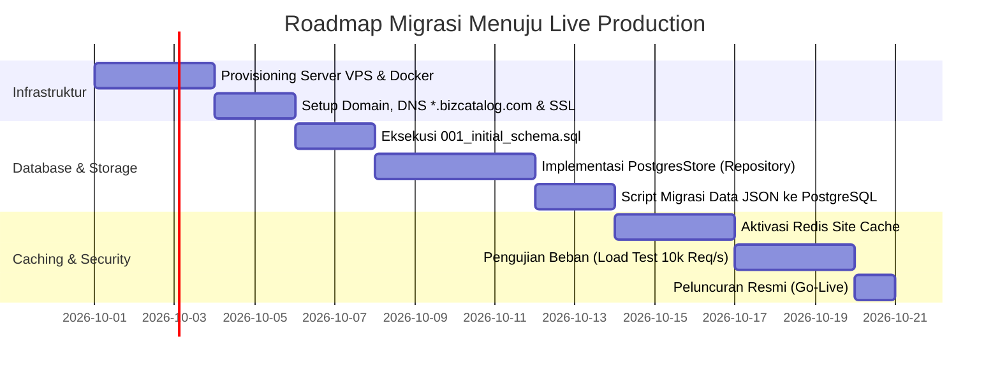

# Dokumentasi Teknis Lengkap Platform BizCatalog Builder
> **Status Dokumen:** Master Technical Specification  
> **Versi:** 1.0.0 (Production Blueprint)  
> **Target Audience:** Tim Pengembang (Full-Stack, Backend, Frontend, DevOps, QA, & System Architect)

---

## DAFTAR ISI
1. [Ringkasan Eksekutif & Gambaran Umum Sistem](#1-ringkasan-eksekutif--gambaran-umum-sistem)
2. [Arsitektur Sistem Tingkat Tinggi (High-Level Architecture)](#2-arsitektur-sistem-tingkat-tinggi-high-level-architecture)
3. [Manajemen Pengguna, Hak Akses & Matriks Langganan](#3-manajemen-pengguna-hak-akses--matriks-langganan)
4. [Arsitektur Frontend & Bedah Tampilan Per Menu (UI/UX & Logic)](#4-arsitektur-frontend--bedah-tampilan-per-menu-uiux--logic)
5. [Katalog Lengkap REST API & Spesifikasi Backend](#5-katalog-lengkap-rest-api--spesifikasi-backend)
6. [Arsitektur Database & Relasi Tabel (Current State vs Future Production)](#6-arsitektur-database--relasi-tabel-current-state-vs-future-production)
7. [Skalabilitas, Caching & Mitigasi "Noisy Neighbor"](#7-skalabilitas-caching--mitigasi-noisy-neighbor)
8. [Panduan Operasional, Konfigurasi & Roadmap Migrasi Production](#8-panduan-operasional-konfigurasi--roadmap-migrasi-production)

---

## 1. Ringkasan Eksekutif & Gambaran Umum Sistem

### 1.1 Visi Produk
**BizCatalog Builder** adalah platform Software-as-a-Service (SaaS) multi-tenant yang dirancang untuk memberdayakan pelaku Usaha Mikro, Kecil, dan Menengah (UMKM) agar dapat mendirikan, mendesain, dan mengelola website profil bisnis sekaligus katalog e-commerce profesional dalam waktu kurang dari 15 menit tanpa memerlukan keahlian pemrograman maupun konfigurasi server yang rumit.

### 1.2 Tiga Pilar Aplikasi
Platform BizCatalog beroperasi sebagai satu ekosistem terpadu yang memadukan 3 fungsi aplikasi utama:



1. **Marketing & Portal Komersial (`/`, `/login`, `/register`)**:  
   Halaman pengenalan produk, perbandingan paket langganan (Free, Pro, Ultimate), serta gerbang registrasi otomatis yang langsung mem-provision website tenant secara instan.
2. **Dashboard CMS Pemilik Bisnis (`/dashboard/*`)**:  
   Panel administrasi berkeamanan JWT tempat pemilik toko mengatur profil perusahaan, rekening bank & QRIS, menyusun produk, mengelola aset gambar, mengonfigurasi tema, merombak susunan blok visual (*section builder*), serta memproses pesanan masuk.
3. **Public Storefront Dinamis (`/site/:subdomain` atau Custom Subdomain)**:  
   Toko online publik yang dirender secara dinamis langsung dari database (tanpa Static Site Generation lambat), dilengkapi keranjang belanja multi-item, alur checkout mandiri, instruksi transfer rekening / QRIS, dan pelacakan pesanan publik.

---

## 2. Arsitektur Sistem Tingkat Tinggi (High-Level Architecture)

### 2.1 Diagram Arsitektur Keseluruhan

Platform menggunakan pendekatan **Decoupled Client-Server Monorepo** dengan kontrak REST API yang ketat:



### 2.2 Komponen Arsitektur Kunci

1. **Frontend**:
   - **Framework**: React 18 dengan TypeScript dan bundler Vite.
   - **Styling**: TailwindCSS dengan utilitas CSS murni untuk theme engine fleksibel (5 preset tema).
   - **State Management**: Zustand untuk autentikasi user (`authStore.ts`) dan keranjang belanja e-commerce (`cartStore.ts`) dengan sinkronisasi ke `localStorage`.
   - **Subdomain Resolver**: Mendeteksi apakah URL dibuka melalui `subdomain.bizcatalog.com` atau route development `/site/:subdomain`.
2. **Backend**:
   - **Bahasa & Framework**: Go (Golang) versi 1.22+ menggunakan framework Gin.
   - **Security**: Autentikasi Stateless JWT (HMAC-SHA256) dengan klaim `user_id` dan `email`.
   - **Middleware Enforcement**: Pengecekan limit kuota paket langganan langsung di layer middleware sebelum request menyentuh database (`SubscriptionLimitMiddleware`).
   - **Repository Pattern**: Seluruh akses data diabstraksikan melalui interface Go [`Repository`](file:///Users/macbookpro/bizcatalog/backend/internal/repository/repository.go), sehingga perubahan dari JSON Store ke PostgreSQL tidak memerlukan perombakan handler satu baris pun.

---

## 3. Manajemen Pengguna, Hak Akses & Matriks Langganan

### 3.1 Siklus Hidup Pengguna (User Lifecycle)
Saat calon pengguna mendaftar melalui form registrasi platform, sistem mengeksekusi operasi transaksi atomik:
1. Validasi keunikan email dan ketersediaan nama `subdomain`.
2. Hashing password menggunakan algoritma **Bcrypt** (cost: 10).
3. Pembuatan record `User` dengan paket default `free`.
4. Pembuatan record `Website` yang terikat ke `user_id` baru.
5. Inisialisasi susunan awal **10 Section Config** (Hero, Promos, Categories, Catalog, About, Gallery, Projects, Testimonials, Contact, Footer) dan kategori awal agar toko langsung dapat diakses dan indah seketika.
6. Penerbitan JWT Token dengan masa berlaku 7 hari.



### 3.2 Matriks Kuota Paket Langganan (Subscription Matrix)

Platform menerapkan pembatasan bertingkat berdasarkan paket langganan yang dipilih pengguna:

| Parameter Evaluasi | Paket FREE (Gratis) | Paket PRO (UMKM Berkembang) | Paket ULTIMATE (Scale-Up / Brand) |
| :--- | :--- | :--- | :--- |
| **Biaya** | Rp 0 / Selamanya | Rp 99.000 / Bulan | Rp 249.000 / Bulan |
| **Maksimal Website** | 1 Website / Toko | 1 Website / Toko | Multi-Website (Hingga 5 Website) |
| **Kapasitas Produk** | **Maksimal 5 Produk** | **Maksimal 25 Produk** | **Maksimal 100 Produk** |
| **Pilihan Tema** | 1 Tema (*Minimalist Clean*) | Semua 5 Tema Desain Lengkap | Semua 5 Tema Desain Lengkap |
| **Asset Library Storage** | 10 MB Maksimal | 100 MB Maksimal | 1 GB Maksimal |
| **Kustomisasi Header** | Default (Dynamic-Scroll) | Bebas (Solid, Floating, Scroll) | Bebas Penuh + Custom Color |
| **Fitur E-Commerce** | Katalog + Order WhatsApp | Transfer Bank + QRIS + COD | Full Payment + Tracking Resi + Multi-Admin |
| **Watermark Platform** | "Powered by BizCatalog" | Tanpa Watermark | Tanpa Watermark + Custom Domain Ready |

### 3.3 Penegakan Kuota (Quota Enforcement Middleware)
Penegakan kuota produk dilakukan di sisi server melalui [`SubscriptionLimitMiddleware`](file:///Users/macbookpro/bizcatalog/backend/internal/middleware/middleware.go):
```go
// Logika Pengecekan Kuota Produk Sebelum Handler CreateProduct Dipanggil:
count, _ := repo.CountProductsByWebsiteID(website.ID)
maxAllowed := 5 // Default paket Free
if user.Plan == models.PlanPro {
    maxAllowed = 25
} else if user.Plan == models.PlanUltimate {
    maxAllowed = 100
}

if count >= maxAllowed {
    c.JSON(403, gin.H{
        "error": "Batas kuota produk untuk paket ini telah tercapai",
        "code":  "PLAN_LIMIT_REACHED",
        "limit": maxAllowed,
    })
    c.Abort()
    return
}
```

---

## 4. Arsitektur Frontend & Bedah Tampilan Per Menu (UI/UX & Logic)

Frontend BizCatalog dibangun menggunakan **React 18** berbasis komponen modular dan terproteksi.

### 4.1 Peta Rute Navigasi (Route Tree)

```text
/ (LandingPage - Portal Utama Platform)
├── /login (LoginPage - Masuk ke Akun)
├── /register (RegisterPage - Pendaftaran Toko Baru)
│
├── /dashboard (DashboardLayout - Layout Shell Terproteksi JWT)
│   ├── /dashboard/ (DashboardOverview - Metrik & Ringkasan Aktivitas)
│   ├── /dashboard/orders (OrdersPage - Manajemen Transaksi & Resi)
│   ├── /dashboard/company (CompanyProfilePage - Info Toko & Rekening)
│   ├── /dashboard/products (ProductCatalogPage - Manajemen Katalog)
│   ├── /dashboard/categories (CategoriesPage - Manajemen Kategori)
│   ├── /dashboard/assets (AssetLibraryPage - Manajemen Gambar & Media)
│   ├── /dashboard/gallery (GalleryTestimonialsPage - Portofolio & Ulasan)
│   ├── /dashboard/theme (ThemeSelectorPage - Pemilihan & Personalisasi Tema)
│   ├── /dashboard/builder (SectionBuilderPage - Visual Drag-and-Drop Builder)
│   └── /dashboard/settings (SettingsPage - Akun & Kuota Langganan)
│
├── /site/:subdomain (PublicWebsiteView - Tampilan Toko Publik Dinamis)
└── /site/:subdomain/order/:orderNumber (PublicOrderDetailPage - Halaman Invoice & Bukti Bayar)
```

---

### 4.2 Analisis Mendalam Per Menu Dashboard

#### 1. Menu Dashboard Overview (`/dashboard`)
* **Tujuan**: Memberikan pandangan instan (*at-a-glance*) mengenai status operasional website bisnis pengguna.
* **Komponen & Visual**:
  - **Banner Status Toko**: Menampilkan URL website aktif `https://{subdomain}.bizcatalog.com` dengan tombol copy link dan tombol preview instan.
  - **4 Stat Card Utama**:
    1. *Total Pesanan*: Akumulasi seluruh pesanan yang masuk ke toko.
    2. *Total Pendapatan (GMV)*: Akumulasi nilai nominal rupiah dari pesanan yang berstatus `paid` atau `completed`.
    3. *Produk Aktif*: Jumlah produk yang terbit dibandingkan kuota paket (contoh: `4 / 5 Produk`).
    4. *Penyimpanan Media*: Bar progres kapasitas storage yang telah terpakai dari total jatah kuota (contoh: `2.4 MB / 10 MB`).
  - **Tabel Pesanan Terbaru**: 5 transaksi paling mutakhir lengkap dengan status pembayaran dan tombol aksi cepat.
  - **Aksi Cepat (Quick Actions)**: Pintasan langsung untuk tambah produk, atur rekening, buka builder, atau ubah tema.

#### 2. Menu Manajemen Pesanan (`/dashboard/orders`)
* **Tujuan**: Pusat pemrosesan pesanan masuk dari pembeli e-commerce toko.
* **Fitur & Logika Teknis**:
  - **Filter Tab Status**: Filter pesanan berdasarkan status: `Semua`, `Menunggu Pembayaran (unpaid)`, `Perlu Verifikasi (waiting_verification)`, `Diproses (processing)`, `Selesai (completed)`, dan `Dibatalkan (cancelled)`.
  - **Modal Verifikasi Bukti Bayar**: Menampilkan foto struk/screenshot pembayaran transfer bank atau QRIS yang diunggah pembeli, dengan tombol verifikasi 1-klik "Setujui Pembayaran" (`payment_status: paid`).
  - **Pembaruan Pengiriman (Fulfillment)**: Input nama kurir ekspedisi (JNE, J&T, SiCepat, Gosend, dll.) dan Nomor Resi Pelacakan (*Airway Bill / AWB*). Status otomatis berubah menjadi `processing` atau `completed`.
  - **Cetak Nota / Invoice**: Fitur cetak faktur pesanan siap print untuk disertakan ke dalam paket kiriman.

#### 3. Menu Profil Usaha & Pembayaran (`/dashboard/company`)
* **Tujuan**: Mengatur identitas komersial toko dan saluran penerimaan dana.
* **Input Fields Terbagi Menjadi 3 Kategori**:
  1. *Identitas & Kontak*: Nama Bisnis, Slogan / Tagline, Deskripsi Profil Bisnis, Alamat Fisik Workshop/Toko, No. Telepon, Email CS, dan No. WhatsApp resmi (dengan format otomatis `628xxx` untuk integrasi checkout WA).
  2. *Kanal Media Sosial*: Akun Instagram, Facebook Page, dan TikTok Profile (otomatis dirender sebagai icon link di footer dan kontak website).
  3. *Saluran Pembayaran (Payment Setup)*:
     - Toggle aktivasi metode **COD (Cash on Delivery)**.
     - Toggle aktivasi **Transfer Bank Manual**: Nama Bank (BCA, Mandiri, BRI, BNI), Nomor Rekening, dan Nama Pemilik Rekening.
     - Toggle aktivasi **QRIS**: Input URL atau unggah gambar barcode QRIS statis toko untuk dipindai oleh pembeli saat checkout.
     - Jam Operasional Toko (misal: "Senin - Sabtu, 08:00 - 17:00 WIB").
     - Gaya Header Navigasi Toko: `Solid`, `Floating Glassmorphism`, atau `Dynamic-Scroll`.

#### 4. Menu Katalog Produk (`/dashboard/products`)
* **Tujuan**: Pengelolaan barang dagangan dan jasa yang ditawarkan kepada calon pembeli.
* **Fitur & Validasi**:
  - **Tabel Interaktif**: Menampilkan thumbnail produk, nama produk, slug otomatis, kategori, harga dalam format Rupiah (`Rp xxx.xxx`), badge status (`Published` hijau / `Draft` abu-abu), dan tombol Edit / Hapus.
  - **Modal Tambah / Ubah Produk**:
    - Nama Produk (otomatis membuat slug URL ramah SEO).
    - Dropdown Kategori (terkoneksi langsung ke tabel `categories`).
    - Harga Jual (validasi numerik positif).
    - Deskripsi Lengkap Produk (spesifikasi bahan, ukuran, garansi).
    - URL Foto Produk (dapat diketik manual atau dipilih langsung dari *Asset Library*).
    - Status Publikasi: Toggle langsung antara `Published` dan `Draft`.
  - **Validasi Kuota Server**: Jika jumlah produk mencapai batas maksimal paket langganan, tombol tambah dinonaktifkan di frontend dan divalidasi ganda di backend dengan respons alert upgrade paket.

#### 5. Menu Kategori Produk (`/dashboard/categories`)
* **Tujuan**: Pengelompokan taksonomi produk agar katalog toko rapi dan mudah dicari pelanggan.
* **Fitur**:
  - CRUD Kategori: Nama Kategori, Slug Kategori (URL-friendly string), dan Deskripsi Kategori.
  - Sinkronisasi instan ke tab filter katalog produk di tampilan publik toko.

#### 6. Menu Asset Library (`/dashboard/assets`)
* **Tujuan**: Manajemen media penyimpanan foto dan logo toko berbasis cloud mini.
* **Fitur**:
  - **Drag-and-Drop Uploader**: Menerima file gambar (`image/jpeg`, `image/png`, `image/webp`) dengan batas ukuran file.
  - **Klasifikasi Tipe Aset**: Dropdown penandaan tipe: `Logo`, `Hero Banner`, `Product`, `Gallery`, atau `Background`.
  - **Galeri Thumbnail Media**: Tampilan grid kartu dengan dimensi file, ukuran dalam Kilobyte, tombol "Salin URL", dan tombol "Hapus".
  - **Indikator Kuota Penyimpanan**: Menghitung secara real-time total ukuran file yang diupload terhadap batas paket (10MB, 100MB, 1GB).

#### 7. Menu Galeri & Testimoni (`/dashboard/gallery`)
* **Tujuan**: Membangun kredibilitas dan bukti sosial (*social proof*) untuk meyakinkan calon pelanggan.
* **Dua Tab Konfigurasi**:
  1. *Tab Galeri Foto*: Daftar portofolio pengerjaan, foto workshop produksi, atau sertifikasi. Setiap item memiliki Judul, URL Gambar, dan Nomor Urutan.
  2. *Tab Testimoni Pelanggan*: Daftar review pembeli dengan field: Nama Pelanggan, Jabatan/Perusahaan (opsional), Isi Review/Feedback, Rating Bintang (1 hingga 5 bintang), dan URL Foto Avatar Pelanggan.

#### 8. Menu Theme Selector (`/dashboard/theme`)
* **Tujuan**: Mengubah seluruh atmosfer visual website toko secara global hanya dengan satu klik tanpa merusak konten data.
* **Katalog 5 Mesin Tema (Theme Engine)**:
  1. **Minimalist Clean (Paket Free)**: Nuansa hitam-putih monokromatik modern, tipografi sans-serif lapang, fokus mutlak pada keindahan foto produk.
  2. **Solid Vibrant (Paket Pro/Ultimate)**: Warna tegas penuh energi (Royal Blue), sudut membulat elegan, kontras tinggi, sangat cocok untuk retail modern dan elektronik.
  3. **Industrial Dark (Paket Pro/Ultimate)**: Nuansa gelap graphite dengan aksen kuning amber teknik, tipografi monospace presisi untuk pabrik, teknik, konstruksi, dan bengkel.
  4. **Formal Luxury (Paket Pro/Ultimate)**: Tipografi serif klasik berwibawa dengan paduan warna emerald tua dan aksen emas untuk butik perhiasan, furnitur kayu jati, atau layanan hukum.
  5. **Lifestyle Aesthetic (Paket Pro/Ultimate)**: Warna hangat terracotta dan cream dengan tombol pill berbentuk kapsul, estetik untuk kafe, bakery, dan fashion brand.
* **Kontrol Tambahan**: Pemilihan warna aksen primer (*Primary Color Picker*) dan gaya navbar (`Solid`, `Floating`, `Dynamic-Scroll`).

#### 9. Menu Visual Section Builder (`/dashboard/builder`)
* **Tujuan**: Website builder berbasis blok modular yang memungkinkan pemilik toko merancang urutan dan tata letak halaman berandanya secara visual.
* **Daftar 10 Blok Section**:
  1. `hero` (Banner Utama & Tagline)
  2. `promos` (Highlight Promosi & Flash Deal)
  3. `categories` (Pintasan Kategori Produk)
  4. `catalog` (Grid Katalog Produk)
  5. `about` (Profil & Sejarah Perusahaan)
  6. `gallery` (Portofolio Foto)
  7. `projects` (Karya & Proyek Terpilih)
  8. `testimonials` (Ulasan Pelanggan)
  9. `contact` (Form & Informasi Kontak / Lokasi)
  10. `footer` (Navigasi Kaki, Medsos & Hak Cipta)
* **Kontrol Per Blok**:
  - **Reordering**: Tombol naik / turun (atau drag handle) untuk mengubah urutan susunan secara fleksibel.
  - **Visibility Toggle**: Sakelar on/off untuk menampilkan atau menyembunyikan section tanpa menghapus datanya.
  - **Layout Variant**: Pemilihan gaya tata letak per section (`Default`, `Split 2-Kolom`, `Centered`, `Grid`, `List`, `Full Banner`).
  - **Customization**: Input Judul Kustom, Subjudul, Perataan Teks (Kiri/Tengah/Kanan), Warna Latar, atau Gambar Latar.
  - **Live Preview Simulator**: Panel pratinjau langsung di sebelah kanan dengan tombol switch mode tampilan Desktop dan Layar Ponsel (Mobile).

#### 10. Menu Pengaturan Akun (`/dashboard/settings`)
* **Tujuan**: Manajemen kredensial pengguna dan kontrol lisensi paket.
* **Fitur**:
  - Data profil pemilik akun (Nama Lengkap, Alamat Email terdaftar).
  - Formulir ganti kata sandi dengan validasi keamanan.
  - Kartu Status Langganan: Indikator paket saat ini, tanggal perpanjangan, dan tombol upgrade paket.

---

### 4.3 Alur Storefront Publik & E-Commerce Checkout

Halaman publik toko (`/site/:subdomain` atau subdomain kustom) beroperasi sebagai Single Page Application dinamis dengan arsitektur checkout terintegrasi:



---

## 5. Katalog Lengkap REST API & Spesifikasi Backend

Semua endpoint dilayani di bawah prefix `/api`. Format request dan response menggunakan standar `application/json` (kecuali upload multipart form data).

### 5.1 Standar Format Respons
```json
// Respons Sukses
{
  "status": "success",
  "data": { ... } // Atau langsung objek/array sesuai DTO model
}

// Respons Error
{
  "error": "Pesan deskriptif kesalahan",
  "code": "ERROR_CODE_OPTIONAL",
  "limit": 5 // Opsional jika pelanggaran batas kuota
}
```

### 5.2 Matriks Lengkap Endpoints

| Grup API | Method | URL Path | Hak Akses | Deskripsi & Payload Kunci |
| :--- | :---: | :--- | :---: | :--- |
| **Health** | `GET` | `/api/health` | Public | Status service dan runtime backend |
| **Auth** | `POST` | `/api/auth/register` | Public | Pendaftaran toko baru (`name, email, password, subdomain, business_name`) |
| **Auth** | `POST` | `/api/auth/login` | Public | Autentikasi user (`email, password`) -> Kembalikan JWT Token |
| **User** | `GET` | `/api/user/profile` | Bearer Auth | Mengambil profil user yang sedang login |
| **User** | `PUT` | `/api/user/profile` | Bearer Auth | Mengubah profil user atau paket langganan (`name, plan`) |
| **Website** | `GET` | `/api/website/my` | Bearer Auth | Mengambil profil bisnis toko milik user saat ini |
| **Website** | `PUT` | `/api/website/my` | Bearer Auth | Mengubah profil bisnis, nomor WA, medsos, rekening bank, & QRIS |
| **Website** | `PUT` | `/api/website/theme` | Bearer Auth | Mengubah tema aktif toko (`theme_id: minimalist\|solid\|...`) |
| **Website** | `GET` | `/api/website/sections` | Bearer Auth | Mengambil 10 susunan konfigurasi visual section toko |
| **Website** | `PUT` | `/api/website/sections` | Bearer Auth | Menyimpan urutan, visibilitas, dan varian layout 10 section |
| **Categories**| `GET` | `/api/categories` | Bearer Auth | Mengambil daftar seluruh kategori produk toko |
| **Categories**| `POST` | `/api/categories` | Bearer Auth | Menambah kategori baru (`name, slug, description`) |
| **Categories**| `PUT` | `/api/categories/:id` | Bearer Auth | Memperbarui nama atau deskripsi kategori |
| **Categories**| `DELETE`| `/api/categories/:id` | Bearer Auth | Menghapus kategori produk |
| **Products** | `GET` | `/api/products` | Bearer Auth | Mengambil daftar seluruh katalog produk milik toko |
| **Products** | `POST` | `/api/products` | Bearer + Limit | Menambah produk baru (Divalidasi kuota paket: 5/25/100) |
| **Products** | `GET` | `/api/products/:id` | Bearer Auth | Mengambil detail 1 produk berdasarkan ID |
| **Products** | `PUT` | `/api/products/:id` | Bearer Auth | Memperbarui data produk (`name, price, category, status, dll`) |
| **Products** | `DELETE`| `/api/products/:id` | Bearer Auth | Menghapus produk dari katalog toko |
| **Assets** | `GET` | `/api/assets` | Bearer Auth | Mengambil daftar aset media yang telah diunggah |
| **Assets** | `POST` | `/api/assets/upload` | Bearer Auth | Unggah file media multipart (`file, type: logo\|hero\|product...`) |
| **Assets** | `DELETE`| `/api/assets/:id` | Bearer Auth | Menghapus file aset dari server dan database |
| **Testimonials**| `GET` | `/api/testimonials` | Bearer Auth | Mengambil seluruh ulasan pelanggan toko |
| **Testimonials**| `POST` | `/api/testimonials` | Bearer Auth | Menambah ulasan (`client_name, feedback, rating, avatar_url`) |
| **Testimonials**| `DELETE`| `/api/testimonials/:id`| Bearer Auth | Menghapus ulasan pelanggan |
| **Galleries** | `GET` | `/api/galleries` | Bearer Auth | Mengambil daftar foto portofolio galeri toko |
| **Galleries** | `POST` | `/api/galleries` | Bearer Auth | Menambah item galeri (`title, image_url, order`) |
| **Galleries** | `DELETE`| `/api/galleries/:id` | Bearer Auth | Menghapus foto galeri |
| **Orders** | `GET` | `/api/orders` | Bearer Auth | Mengambil seluruh pesanan masuk ke toko milik user |
| **Orders** | `PUT` | `/api/orders/:id` | Bearer Auth | Admin update: status bayar, kurir pengiriman, nomor resi |
| **Orders** | `PUT` | `/api/orders/:id/status` | Bearer Auth | Ubah status alur pesanan (`processing, completed, cancelled`) |
| **Public** | `GET` | `/api/public/website/:subdomain` | Public | **Mega-Query Toko**: Mengambil info toko, kategori, produk terbit, section, galeri & ulasan sekaligus |
| **Public** | `POST` | `/api/public/website/:subdomain/orders` | Public | Pembeli checkout membuat pesanan baru |
| **Public** | `GET` | `/api/public/website/:subdomain/orders/:order_number` | Public | Pembeli melacak detail pesanan & invoice publik |
| **Public** | `POST` | `/api/public/website/:subdomain/orders/:order_number/payment-proof` | Public | Pembeli mengunggah struk/screenshot bukti transfer |
| **Public** | `POST` | `/api/public/website/:subdomain/orders/:order_number/confirm` | Public | Pembeli mengonfirmasi pembayaran selesai |

---

## 6. Arsitektur Database & Relasi Tabel (Current State vs Future Production)

### 6.1 Kondisi Saat Ini (Current State — Modular Separated Tables JSON Store)

Pada fase pengembangan dan MVP saat ini, sistem mengadopsi penyimpanan berbasis file terisolasi di direktori `backend/data/tables/`.



* **Pemisahan 9 File Tabel**:
  1. `users.json`: Menyimpan ID, email, hash password, nama, dan paket langganan.
  2. `websites.json`: Menyimpan data usaha, subdomain unik, tema, nomor WA, rekening bank, QRIS, dan header style.
  3. `categories.json`: Menyimpan kategori per website (`website_id`, nama, slug).
  4. `products.json`: Menyimpan katalog produk (`website_id`, nama, slug, harga, gambar, status).
  5. `sections.json`: Menyimpan 10 susunan blok visual per website (`website_id`, tipe, urutan, varian).
  6. `orders.json`: Menyimpan transaksi pesanan (`website_id`, order_number, nama pelanggan, items array, total, status bayar, no resi).
  7. `assets.json`: Menyimpan metadata media (`website_id`, nama file, URL, ukuran byte).
  8. `testimonials.json`: Menyimpan ulasan pembeli (`website_id`, nama, feedback, rating bintang).
  9. `galleries.json`: Menyimpan portofolio gambar (`website_id`, judul, URL, urutan).
* **Fitur Keandalan JSON Store**:
  - **Terisolasi per Domain**: Penulisan pesanan (`orders.json`) tidak mengunci pembacaan katalog produk (`products.json`).
  - **Atomic File Swapping**: Setiap mutasi ditulis ke file sementara (`.tmp`) terlebih dahulu sebelum di-rename secara atomik oleh OS, menjamin tidak pernah terjadi *file corruption* jika server mati mendadak saat proses simpan.
  - **Relasi Menggunakan Kunci Logis**: Relasi dijaga di memory Go menggunakan string matching pada field `user_id` dan `website_id`.

---

### 6.2 Kondisi Masa Depan (Future Production State — PostgreSQL 14+ Relational Engine)

Pada lingkungan Live Production berskala tinggi, seluruh data dipindahkan ke **PostgreSQL 14+** (atau MySQL 8.0+) yang telah dirancang secara formal pada berkas [`backend/migrations/001_initial_schema.sql`](file:///Users/macbookpro/bizcatalog/backend/migrations/001_initial_schema.sql).

#### Diagram Relasi Entitas (Complete Entity Relationship Diagram - ERD)



#### Spesifikasi Integritas & Indexing Production
1. **Aturan Foreign Key & Penghapusan Bersih (Cascading Delete)**:
   - Jika akun `User` dihapus, relasi `ON DELETE CASCADE` pada `websites` otomatis membersihkan seluruh website miliknya.
   - Jika `Website` dihapus, seluruh kategori, produk, section, galeri, aset, testimoni, dan histori pesanan terkait ikut terhapus otomatis secara bersih tanpa meninggalkan data sampah (*orphaned records*).
   - Pada tabel `order_items`, jika master produk dihapus (`products`), nilai `product_id` diubah menjadi `NULL` (`ON DELETE SET NULL`), sehingga rekaman transaksi pesanan lama tetap utuh untuk kebutuhan pembukuan akuntansi toko.
2. **Indeks Performa Tinggi (Performance Indexes)**:
   - `idx_websites_subdomain`: B-Tree Index untuk pencarian instan domain toko saat pengunjung datang.
   - `idx_products_website`: Mempercepat query katalog per toko.
   - `idx_orders_website` & `idx_orders_number`: Mempercepat dashboard transaksi dan pelacakan resi pembeli.
   - `idx_sections_website_order`: Menjamin pengurutan section visual (`order ASC`) dieksekusi dalam sub-milidetik.
3. **Row-Level Security (RLS) PostgreSQL**:
   Untuk menjamin data antar toko terisolasi secara mutlak di tingkat mesin database:
   ```sql
   ALTER TABLE orders ENABLE ROW LEVEL SECURITY;
   CREATE POLICY tenant_order_isolation ON orders
       USING (website_id = current_setting('app.current_website_id', true));
   ```

---

## 7. Skalabilitas, Caching & Mitigasi "Noisy Neighbor"

Dalam arsitektur SaaS multi-tenant di mana ribuan toko berbagi database yang sama, risiko terbesar adalah fenomena **Noisy Neighbor**: *ketika salah satu toko viral di media sosial dan kebanjiran puluhan ribu pembeli sekaligus, toko-toko lain berisiko melambat akibat perebutan sumber daya CPU dan database.*

Platform BizCatalog telah merancang **4 Lapisan Pertahanan (*Defense-in-Depth*)**:



1. **Lapisan 1 — Edge CDN (Cloudflare)**: Seluruh file upload gambar, logo, file CSS, dan JS dikirimkan melalui Cloudflare Cache. Server backend hanya menerima request data dinamis.
2. **Lapisan 2 — Tenant Rate Limiting**: Dipasang di layer middleware Go untuk membatasi lonjakan bot/DDoS:
   - Paket Free: Max 120 req/menit.
   - Paket Pro: Max 1.200 req/menit.
   - Paket Ultimate: Max 6.000 req/menit. Kelebihan traffic ditolak dengan kode `HTTP 429 Too Many Requests`.
3. **Lapisan 3 — Redis In-Memory Caching (Peredam Utama)**:
   - Endpoint `GET /api/public/website/:subdomain` disimpan di Redis dengan TTL 10 menit.
   - **Pola Invalidation Real-Time**: Ketika pemilik toko mengubah produk atau tema di dashboard, backend langsung memanggil `redis.Del("cache:site:" + subdomain)`. Toko langsung terupdate seketika tanpa jeda basi (*stale cache*).
4. **Lapisan 4 — PgBouncer Connection Pooling**:
   - PostgreSQL membatasi koneksi konkurensi (misal: 150 koneksi). PgBouncer dengan mode *Transaction Pooling* memungkinkan 10.000 goroutine Go berbagi 25 koneksi fisik PostgreSQL secara bergantian tanpa lonjakan RAM.

---

## 8. Panduan Operasional, Konfigurasi & Roadmap Migrasi Production

### 8.1 Variabel Lingkungan (Environment Variables)

#### Backend (`backend/.env`)
```bash
# Server Configuration
PORT=8080
GIN_MODE=release # debug | release
JWT_SECRET=rahasia-kunci-jwt-super-aman-bizcatalog-2026-xyz

# Storage Type (json | postgres)
DB_DRIVER=json
DATA_PATH=./data/db.json
UPLOAD_DIR=./uploads

# Production PostgreSQL Configuration (Saat DB_DRIVER=postgres)
DB_HOST=127.0.0.1
DB_PORT=5432
DB_USER=bizcatalog_admin
DB_PASSWORD=password_db_sangat_rahasia
DB_NAME=bizcatalog_production
DB_SSLMODE=disable

# Redis Cache Configuration
REDIS_HOST=127.0.0.1:6379
REDIS_PASSWORD=
REDIS_DB=0

# S3 / Cloudflare R2 Media Storage (Opsional Production)
S3_ENDPOINT=https://<account_id>.r2.cloudflarestorage.com
S3_BUCKET=bizcatalog-assets
S3_ACCESS_KEY=xxx
S3_SECRET_KEY=xxx
```

#### Frontend (`frontend/.env`)
```bash
# URL Backend API Gateway
VITE_API_BASE_URL=/api
# Domain Utama Platform untuk Subdomain Routing
VITE_APP_DOMAIN=bizcatalog.com
```

---

### 8.2 Konfigurasi Deployment Produksi (Docker Compose Blueprint)

Untuk menjalankan seluruh infrastruktur produksi dalam satu orkestrasi kontainer:

```yaml
version: '3.8'

services:
  # 1. Reverse Proxy & SSL Edge
  proxy:
    image: nginx:alpine
    ports:
      - "80:80"
      - "443:443"
    volumes:
      - ./nginx.conf:/etc/nginx/nginx.conf:ro
      - ./ssl:/etc/ssl/certs:ro
    depends_on:
      - frontend
      - backend

  # 2. Frontend React SPA Container
  frontend:
    build:
      context: ./frontend
      dockerfile: Dockerfile
    expose:
      - "80"

  # 3. Backend Go Gin Engine
  backend:
    build:
      context: ./backend
      dockerfile: Dockerfile
    environment:
      - PORT=8080
      - GIN_MODE=release
      - DB_DRIVER=postgres
      - DB_HOST=pgbouncer
      - DB_PORT=6432
      - DB_USER=bizcatalog_admin
      - DB_PASSWORD=password_db_sangat_rahasia
      - DB_NAME=bizcatalog_production
      - REDIS_HOST=redis:6379
    volumes:
      - ./backend/uploads:/app/uploads
    depends_on:
      - pgbouncer
      - redis

  # 4. PgBouncer Connection Pooler
  pgbouncer:
    image: edoburu/pgbouncer:latest
    environment:
      - DB_USER=bizcatalog_admin
      - DB_PASSWORD=password_db_sangat_rahasia
      - DB_HOST=postgres
      - DB_NAME=bizcatalog_production
      - POOL_MODE=transaction
      - MAX_CLIENT_CONN=1000
      - DEFAULT_POOL_SIZE=25
    ports:
      - "6432:6432"
    depends_on:
      - postgres

  # 5. Database PostgreSQL Master
  postgres:
    image: postgres:15-alpine
    environment:
      - POSTGRES_USER=bizcatalog_admin
      - POSTGRES_PASSWORD=password_db_sangat_rahasia
      - POSTGRES_DB=bizcatalog_production
    volumes:
      - postgres_data:/var/lib/postgresql/data
      - ./backend/migrations:/docker-entrypoint-initdb.d:ro

  # 6. Redis In-Memory Cache
  redis:
    image: redis:7-alpine
    command: redis-server --appendonly yes
    volumes:
      - redis_data:/data

volumes:
  postgres_data:
  redis_data:
```

---

### 8.3 Rencana Kerja & Checklist Migrasi Bertahap (Production Migration Checklist)

Ketika BizCatalog siap diluncurkan secara publik ke server cloud berbayar:



- [x] **Tahap 1 (Selesai)**: Desain arsitektur database modular JSON terpisah per tabel dengan konkurensi aman (`sync.RWMutex`).
- [x] **Tahap 2 (Selesai)**: Penyusunan skema relasional lengkap PostgreSQL di `001_initial_schema.sql`.
- [x] **Tahap 3 (Selesai)**: Penegakan abstraksi Repository Pattern Go pada handler sehingga bebas dari keterikatan database fisik.
- [ ] **Tahap 4 (Next Step)**: Buat implementasi struct `PostgresStore` di `backend/internal/repository/postgres_store.go` menggunakan driver `pgx` yang memenuhi seluruh kontrak interface `repository.Repository`.
- [ ] **Tahap 5**: Buat CLI script sederhana satu kali jalan (`cmd/migrate/main.go`) untuk membaca seluruh isi `backend/data/tables/*.json` dan melakukan `INSERT` massal ke tabel PostgreSQL.
- [ ] **Tahap 6**: Pasang middleware Redis Caching pada route publik dan aktifkan SSL Wildcard `*.bizcatalog.com` di Cloudflare.

---

> **Catatan Penutup Arsitek:**  
> Dokumen ini merupakan *single source of truth* teknis untuk BizCatalog Builder. Seluruh implementasi modul baru atau refactoring kode di masa mendatang wajib merujuk pada standar relasi, kontrak interface, dan filosofi arsitektur yang telah diuraikan dalam dokumen ini.
